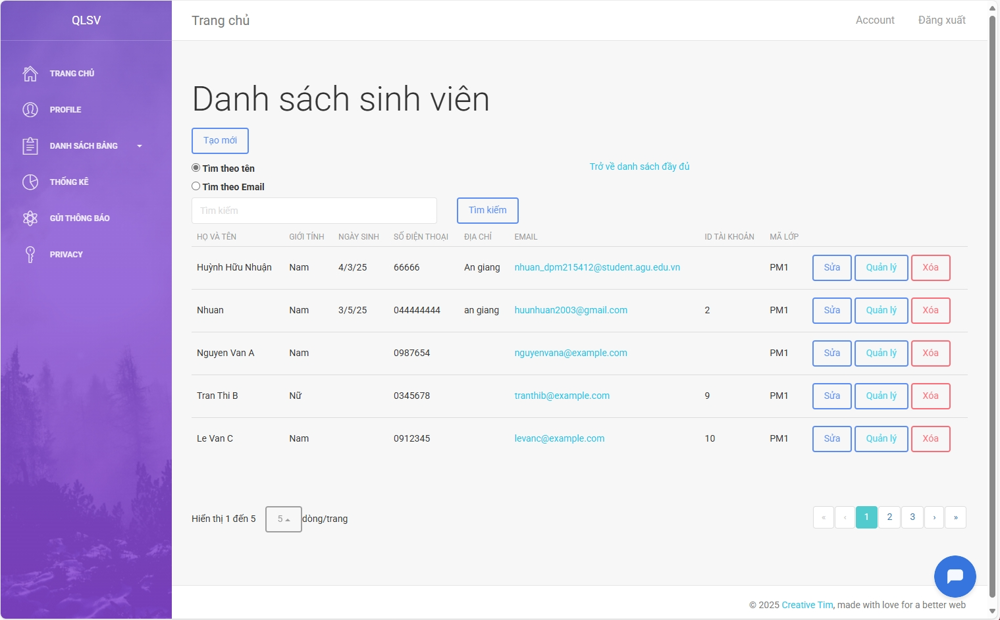

# WebQuanLySinhVien 
*Hệ thống quản lý sinh viên viết bằng ASP.NET MVC + SQL Server.*
# Chức năng chính

##  Tính năng chính
-  Đăng nhập / Đăng xuất / Quên mật khẩu
-  Quản lý sinh viên, lớp học, môn học...
-  Thống kê
-  Xuất báo cáo
-  Gửi email thông báo
-  AI hỗ trợ

# Cài đặt
**Yêu cầu hệ thống**
- Hệ điều hành: Windows 10 trở lên
- .NET SDK: .NET 8.0 trở lên
- IDE: Visual Studio 2022
- Hệ quản trị cơ sở dữ liệu: SQL Server 2022 
- Trình duyệt: Chrome / Edge / Firefox
  
**Thư viện sử dụng**
- BCrypt.Net-Next                                       
- Microsoft.EntityFrameworkCore             
- Microsoft.EntityFrameworkCore.SqlServer
- Microsoft.EntityFrameworkCore.Tools 
- Microsoft.VisualStudio.Web.CodeGeneration.Design
- QuestPDF
- X.PagedList.Mvc.Core

**Các bước**
1. Clone dự án
2. Setup database (SQL Server) - Sử dụng file database
3. Cập nhật connection string - trong thư mục appsetting.json
4. Chạy dự án
5. Tài khoản
   - Tên đăng nhập (Admin): tk002
   - Mật khẩu: 123

# Công nghệ sử dụng
**Backend:** ASP.NET MVC (C#)  
**Database:** SQL Server  
**Frontend:** Bootstrap  
**AI:** Botpress  
**Khác:** Entity Framework, LINQ

#  Ảnh minh họa

###  Trang đăng nhập

  

###  Danh sách sinh viên

  

###  Dashboard thống kê

  

# Người thực hiện
Huỳnh Hữu Nhuận - huunhuan2003@gmail.com
